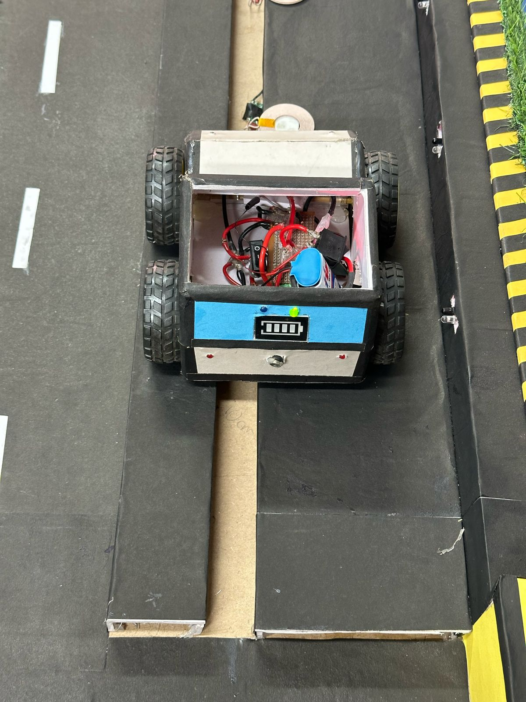
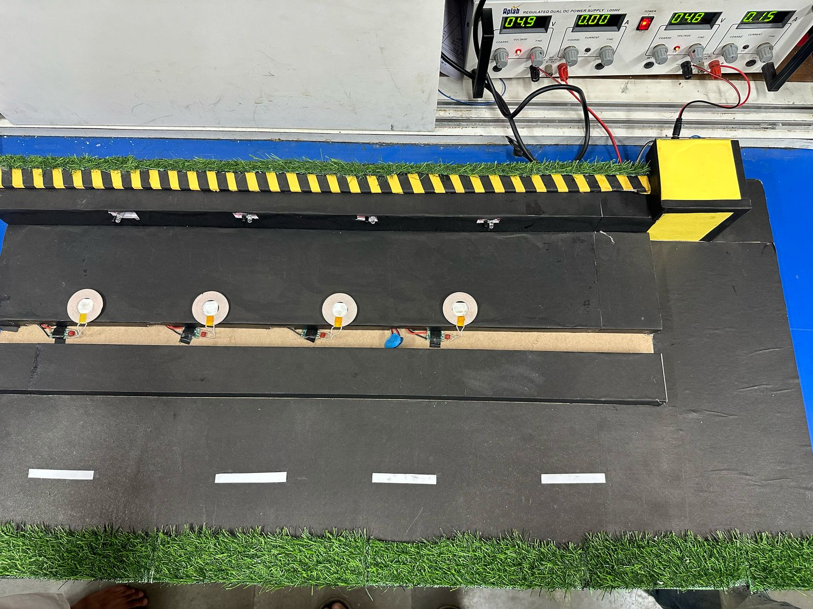
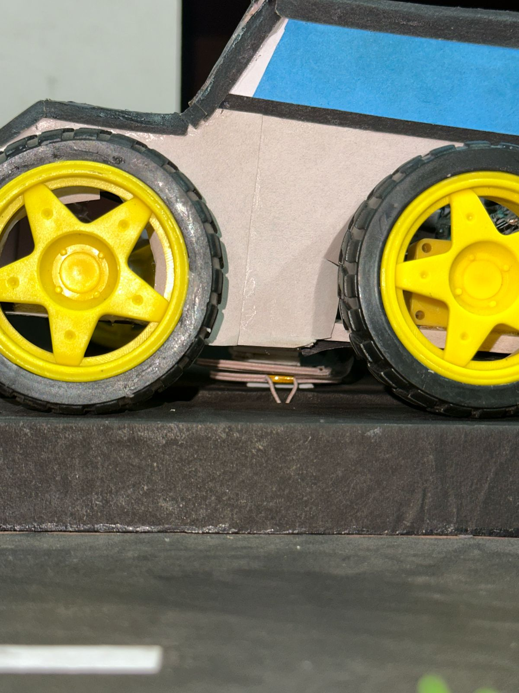

<h1>GREEN ENERGY DRIVEN TRANPORTATION AND WIRELESS EV CHARGING ROADS</h1>

The increasing global demand for sustainable transportation solutions has led to significant innovations in the electric vehicle (EV) industry and innovative charging infrastructure.
  In this report, we propose the emerging concept of integrating renewable energy sources with wireless charging road systems, presenting a compelling synergy to address the challenges hindering widespread EV adoption.
  The current state of the electric vehicle market leads in reducing greenhouse gas emissions and dependence on fossil fuels Solar panels, wind turbines, and energy storage systems are incorporated to power the charging infrastructure, reducing its reliance on non-renewable energy sources and enhancing sustainability. Next, we present the concept of wireless charging roads, which have the potential to revolutionize EV charging. These systems leverage inductive charging technology embedded within road surfaces to replenish EV batteries while in motion, effectively. By harnessing clean energy sources, overcoming range limitations, 
  and enhancing the overall EV experience, this technology represents a pioneering step towards a greener, more efficient, and sustainable future for mobility.

  <h2>DYNAMIC WIRELESS CHARGING ROADS</h2>

  
The Wireless Charging Road system is designed to provide on-the-go charging for electric vehicles. Transmitter coils are embedded within the road surface, powered by the renewable energy system. When an electric vehicle moves over the charging lane, IR sensors detect its presence and activate the corresponding transmitter coils. These coils induce current in the vehicle's receiver coil, enabling wireless power transfer without physical connectors.8
An Arduino Nano microcontroller manages the coil activation process, ensuring that only the relevant section of the road is powered to optimize energy efficiency. As the vehicle moves forward, the previous coil section turns off while the next section activates, ensuring continuous charging. The charging status and power levels are monitored using voltage and current sensors, and the data is displayed on the system's dashboard via the ESP32 web interface.

  

    
  

  <h2>Overhead Charging System</h2>
  
For heavy transport vehicles, an Overhead Locomotive Charging System is implemented. Overhead power lines are installed along designated lanes on highways, supplying direct grid power to electric trucks and buses. These vehicles are equipped with a pantograph system, which is manually deployed by the driver when entering the electrified lane.
The pantograph features a suspension-based adjustment mechanism, allowing it to adapt to variations in wire height while maintaining consistent contact with the overhead power lines. Arduino Nano microcontrollers are used to detect when the pantograph is connected to the overhead wire, ensuring smooth power transfer. When connected, the vehicle draws power directly from the grid while simultaneously charging its onboard battery.
If the pantograph disconnects due to lane changes or road conditions, the system automatically switches to battery mode, allowing the vehicle to continue operation seamlessly. The LCD display inside the vehicle indicates the current power source, displaying “Source: Overhead” when connected and “Source: Battery” when disconnected.

